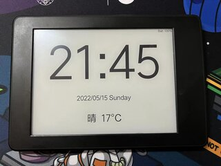

# Kindle Clock

让你闲置的 Kindle 变成一个时钟

本项目主要是改动的 mattzzw 的 [kindle-clock](https://github.com/mattzzw/kindle-clock) 项目，以适配 KPW3

## 文件简介
* `kindle-clock.sh`: 主程序代码
* `config.xml`: KUAL 配置文件
* `menu.json`: KUAL 配置文件

## Kindle 前置准备:
* Kindle 需要越狱
* 安装 KUAL
* 安装 MRInstaller

## 安装 Kindle-Clock:
* Kindle 通过 `USB` 连接到电脑
* 在 `extensions` 文件夹下创建一个名为 `clock` 的文件夹
* 把 `config.xml`、`kindle-clock.sh` 和 `menu.json` 三个文件复制到 `clock` 文件夹下

## 打开 Clock
* 打开 KUAL 点击 Clock

## 如何停止
* 强制重启（按住电源键 10 秒）

